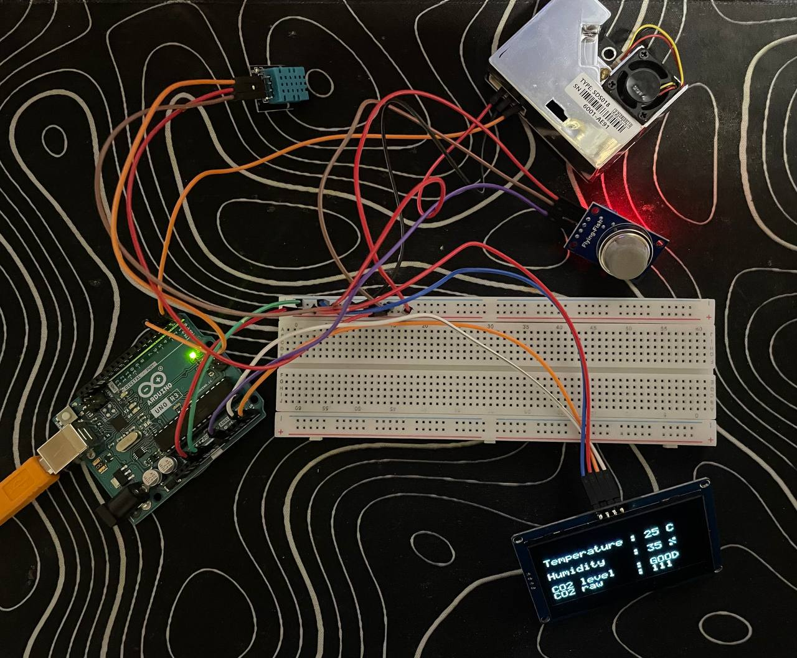
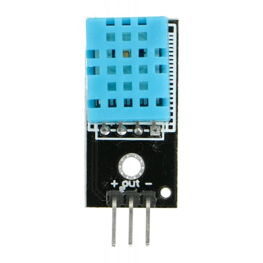
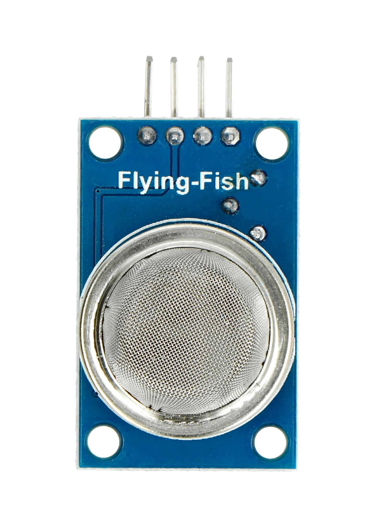
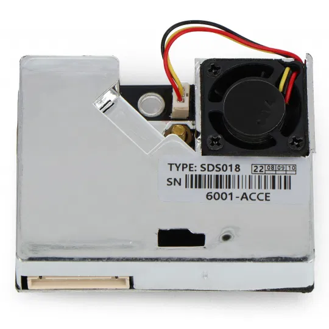
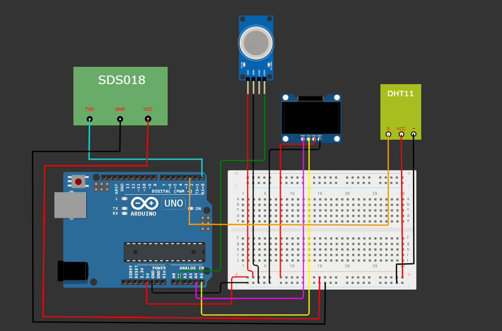
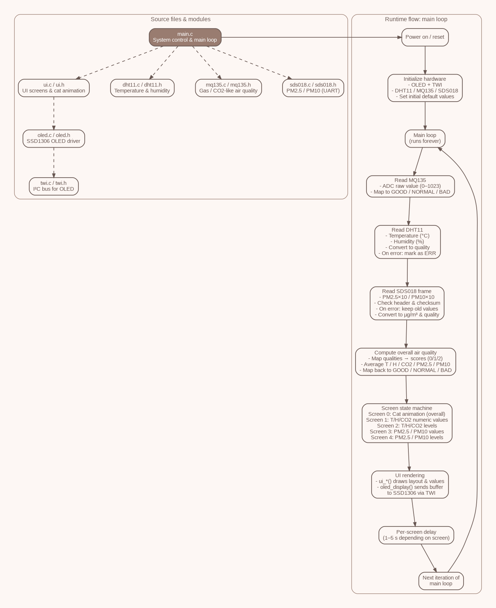

# Air Quality Monitoring System (Arduino Uno Project)

This project is a complete air-quality monitoring system built on the ATmega328P (Arduino Uno).  
It measures temperature, humidity, CO₂/air quality, PM2.5, and PM10 levels and displays the results on an OLED I2C display, including a simple animated UI.

---

## Project Photo
<p align="center">
  
</p>

---

## Team Members

**Nikita Krasilnikov**  
- Created the GitHub repository  
- Wrote the project documentation  
- Implemented the OLED I2C display interface and UI  

**Danat Pustynnikov**  
- Implemented the MQ135 gas sensor module  
- Implemented communication with the SDS018 laser dust sensor  

**Rauf Iusupov**  
- Created the project presentation  
- Edited the demonstration video  
- Implemented the DHT11 temperature & humidity sensor  

---

## Problem Statement and Solution Overview

### Problem  
Indoor air quality directly affects comfort, productivity, and health. Poor ventilation, dust particles, humidity imbalance, and increased CO₂ levels lead to fatigue, headaches, and long-term health issues.  
Many environments lack a simple, low-cost system that shows real-time air quality.

### Solution  
The system uses an embedded microcontroller (ATmega328P) to:

- Read data from multiple air-quality sensors  
- Process and classify environmental parameters (GOOD / NORMAL / BAD)  
- Display real-time values and status on an OLED screen  
- Provide an animated visual indicator for overall air quality  

The MCU allows continuous monitoring without a computer and presents the data in a clear, user-friendly format.

---

## List of Hardware Components

### Sensors

---

### **DHT11 – Temperature & Humidity Sensor**
<p align="center">
  
</p>

**Description:**  
DHT11 contains a resistive humidity element and an NTC thermistor, managed by an internal 8-bit MCU. It outputs data via a **single-wire digital protocol**.  
Provides basic temperature and humidity measurements.

**Advantages:**
- Very low price  
- Easy to connect  
- Low power consumption  
- Internally calibrated digital output  

**Disadvantages:**
- Low accuracy (±5%RH, ±2°C)  
- Low resolution (1°C, 1%RH)  
- Slow response  

**Interface used:**  
**Single-wire digital**, connected to Arduino digital pin.

---

### **MQ135 – Air Quality / CO₂ Approximation Sensor**
<p align="center">
  
</p>

MQ-135 uses a heated SnO₂ sensitive layer whose resistance changes depending on the concentration of gases such as **NH₃, NOx, benzene, alcohol, smoke, and CO₂**.  
**It does NOT measure true CO₂ concentration in ppm** — only an approximation of "air quality".  
It also consumes a lot of power due to its internal heater (~800 mW).

**Advantages:**
- Very inexpensive  
- Easy analog interface  
- Wide range of detectable gases  

**Disadvantages:**
- Does *not* measure CO₂ directly  
- Very power-hungry (heater required)  
- Requires long preheating (24 hours for calibration)  
- Output highly unstable and environment-dependent  
- Poor long-term accuracy  

**Interface used:**  
**Analog signal** → Arduino **A1**.

---

### **SDS018 – Laser Dust Sensor (PM2.5 / PM10)**
<p align="center">
  
</p>

**Description:**  
SDS018 uses a **laser scattering principle**: particles passing through a laser beam reflect light toward a photodiode, producing pulses proportional to particle size and quantity.  
It includes an internal **fan** to ensure stable airflow.  
Outputs **PM2.5 and PM10 in μg/m³** through UART every second.

**Advantages over Sharp GP2Y1010AU0F:**
- True **laser-based** measurement (Sharp uses IR LED → less accurate)  
- Higher accuracy and repeatability  
- Built-in fan ensures consistent airflow  
- Provides digital PM values directly via UART  
- Resolution down to **0.3 μm particles**  

**Disadvantages:**
- Larger physical size  
- Fan produces some noise  
- Limited laser lifetime (~8000 hours)  

**Interface used:**  
**UART 9600 baud**  
- SDS018 TX → Arduino RX(D0)  

---

## Other Components

### **OLED SSD1306 (128×64, I²C)**
<p align="center">
  
</p>

**Description:**  
A monochrome 128×64 pixel OLED display driven by the SSD1306 controller. Used to show sensor readings and air quality animations.

**Advantages:**
- Very easy to connect (only 2 data lines)  
- Low power consumption  
- High contrast and readability  
- Supports graphics and custom UI  

**Disadvantages:**
- Small size  
- Monochrome  
- OLED organic degradation over time  

**Interface used:**  
**I²C**  
- SDA → Arduino A4  
- SCL → Arduino A5  

---

### Additional Components
- **Arduino Uno (ATmega328P)** — system controller  
- **Breadboard, jumper wires, USB cable** — assembly and power  

---

## Why These Components  
Each sensor provides a different environmental parameter:  
DHT11 handles temperature/humidity, MQ135 handles gases/CO₂ approximation, and SDS018 measures PM2.5/PM10 dust.  
Together they form a complete, affordable, and reliable indoor air monitoring system.

---

## Wiring Diagram
<p align="center">
  
</p>

---

## Software

The firmware is written in bare-metal C for the ATmega328P and is organised around a simple
blocking main loop. Each iteration of the loop reads all sensors, computes an overall
air-quality score, and updates one of several UI screens on the OLED display.

### 1. System initialisation

At power-up the firmware configures the display and all sensors:

```c
int main(void)
{
    // Display
    oled_init(OLED_DISP_ON);      // SSD1306 over I²C (twi.c/twi.h)
    oled_charMode(NORMALSIZE);

    // Sensors
    dht11_init();                 // temperature & humidity
    mq135_init();                 // gas / CO₂-like air quality (ADC)
    sds018_init();                // PM2.5 / PM10 (UART)

    _delay_ms(2000);              // allow sensors to stabilise before first read

    // Initial defaults and screen state are set here...
    // (temp, hum, pm25_10, pm10_10, quality strings, screen index, timers)

    while (1) {
        // main measurement & display cycle
    }
}
```
### 2. One measurement / display cycle.
Inside the infinite loop the firmware performs one full measurement and display cycle
in five logical steps:
```c
while (1)
{
    /* 1) Read MQ135 and map to CO₂-like quality label */
    mq_raw     = mq135_read_raw();          // raw ADC 0–1023
    mq_quality = mq135_get_quality(mq_raw); // "GOOD" / "NORMAL" / "BAD"
    co2_q      = mq_quality;

    /* 2) Read DHT11 (temperature & humidity) and classify */
    int16_t t_read = 0;
    int16_t h_read = 0;
    uint8_t status = dht11_read(&t_read, &h_read);

    if (status == DHT11_OK) {
        temp   = (int)t_read;               // °C
        hum    = (int)h_read;               // %
        temp_q = quality_from_value(temp);  // "GOOD"/"NORMAL"/"BAD"
        hum_q  = quality_from_value(hum);
    } else {
        temp_q = "ERR";
        hum_q  = "ERR";
    }

    /* 3) Read SDS018 (PM2.5/PM10 via UART) and keep last valid data */
    uint16_t pm25_tmp = pm25_10;
    uint16_t pm10_tmp = pm10_10;

    if (sds018_read(&pm25_tmp, &pm10_tmp) == 0) {
        pm25_10 = pm25_tmp;                 // PM2.5 × 10
        pm10_10 = pm10_tmp;                 // PM10 × 10
    }

    int pm25_int = pm25_10 / 10;            // e.g. 253 → 25.3 µg/m³
    int pm10_int = pm10_10 / 10;
    pm25_q = quality_from_value(pm25_int);
    pm10_q = quality_from_value(pm10_int);

    /* 4) Compute overall air-quality score from all sensors */
    int s_temp = quality_to_score(temp_q);  // GOOD=0, NORMAL=1, BAD/ERR=2
    int s_hum  = quality_to_score(hum_q);
    int s_co2  = quality_to_score(co2_q);
    int s_pm25 = quality_to_score(pm25_q);
    int s_pm10 = quality_to_score(pm10_q);

    int avg_score = (s_temp + s_hum + s_co2 + s_pm25 + s_pm10) / 5;
    const char *overall_quality = score_to_quality(avg_score);

    /* 5) UI state machine: select and update current screen */
    switch (screen) {
    case 0:
        ui_show_cat(overall_quality);           // animated cat + overall label
        _delay_ms(1000);
        if (++seconds_in_screen >= 3) { screen = 1; seconds_in_screen = 0; }
        break;

    case 1:
        screen_temp_hum_values(temp, hum, co2_q, mq_raw);
        _delay_ms(1000);
        if (++seconds_in_screen >= 5) { screen = 2; seconds_in_screen = 0; }
        break;

    case 2:
        screen_temp_hum_levels(temp_q, hum_q, co2_q);
        _delay_ms(1000);
        if (++seconds_in_screen >= 2) { screen = 3; seconds_in_screen = 0; }
        break;

    case 3:
        screen_pm_values((int)pm25_10, (int)pm10_10);
        _delay_ms(1000);
        if (++seconds_in_screen >= 5) { screen = 4; seconds_in_screen = 0; }
        break;

    case 4:
        screen_pm_levels(pm25_q, pm10_q);
        _delay_ms(1000);
        if (++seconds_in_screen >= 2) { screen = 0; seconds_in_screen = 0; }
        break;
    }
}
```
Design choices:
Integer-only processing – PM values are kept as “×10” integers, which avoids floating-point overhead on an 8-bit MCU.

Quality labels + numeric score – helper functions.
```c
static const char *quality_from_value(int v);
static int         quality_to_score(const char *q);
static const char *score_to_quality(int s);
```
Сonvert raw readings into GOOD / NORMAL / BAD, then into numeric scores
(0, 1, 2) and back. This makes it easy to combine all sensors into a single
“overall air-quality” value while still keeping the logic integer-only.
### 3. UI rendering and screen rotation
The high-level UI module converts processed values into human-readable screens:
```c
void screen_temp_hum_values(int t, int h,
                            const char *co2_q,
                            uint16_t co2_raw);

void screen_temp_hum_levels(const char *t_q,
                            const char *h_q,
                            const char *co2_q);

void screen_pm_values(int pm25_10, int pm10_10);

void screen_pm_levels(const char *pm25_q,
                      const char *pm10_q);

void ui_show_cat(const char *overall_quality);

```
Each function draws static labels once and then only updates changing values
(temperature, humidity, PM values or quality labels). The screen and
seconds_in_screen variables in main.c implement a small state machine that
automatically rotates between:
1. animated cat with overall air-quality label,
2. numeric temperature / humidity / CO₂ (MQ135) values,
3. qualitative T/H/CO₂ levels,
4. numeric PM2.5 / PM10 values,
5. qualitative PM2.5 / PM10 levels.

Automatic screen rotation removes the need for buttons or a
menu system, keeping the hardware simple while still presenting all important
information to the user. The UI code in ui.c/oled.c is decoupled from sensor
drivers, so layout and graphics can be changed without touching measurement code.

---

## Project Demonstration Video
[(demostration video)](https://youtu.be/z08kOE73X8o)

---

## Project Poster and Block diagram
<p align="center">
  
</p>
<p align="center">
  
</p>

---

## Future Improvements

- **Upgrade the temperature & humidity sensor (replace DHT11 with DHT22)**  
  The DHT22 provides noticeably better accuracy and resolution (±0.5°C vs ±2°C for DHT11, and humidity accuracy of ±2–5% vs ±5–10%).  
  It also supports a wider measurement range, making the collected data more reliable.

- **Create a custom 3D-printed enclosure and a dedicated PCB**  
  A proper case would protect the electronics, improve airflow for sensors, and make the device look like a finished product.  
  Designing a PCB would remove the need for a breadboard, increase durability, and reduce electrical noise.

- **Use a more advanced CO₂ sensor (e.g., Sensirion STC31 or SCD4x series)**  
  These sensors measure actual CO₂ concentration in ppm rather than estimating "air quality" like MQ135.  
  This upgrade would dramatically improve accuracy and make the project suitable for real environmental monitoring.

---

## References

- **DHT11 Sensor Datasheet**  
  https://botland.cz/index.php?controller=attachment&id_attachment=251

- **MQ135 Gas Sensor Datasheet**  
  https://www.olimex.com/Products/Components/Sensors/Gas/SNS-MQ135/resources/SNS-MQ135.pdf

- **SDS018 Laser Dust Sensor Manual**  
  https://botland.cz/index.php?controller=attachment&id_attachment=1887

- **SSD1306 OLED Display Controller Datasheet**  
  https://cdn-shop.adafruit.com/datasheets/SSD1306.pdf

- **ATmega328P Microcontroller Datasheet**  
  https://ww1.microchip.com/downloads/en/DeviceDoc/Atmel-7810-Automotive-Microcontrollers-ATmega328P_Datasheet.pdf

- **Project Laboratory Materials (AVR Labs)**  
  https://github.com/tomas-fryza/avr-labs/tree/master/lab8-project
